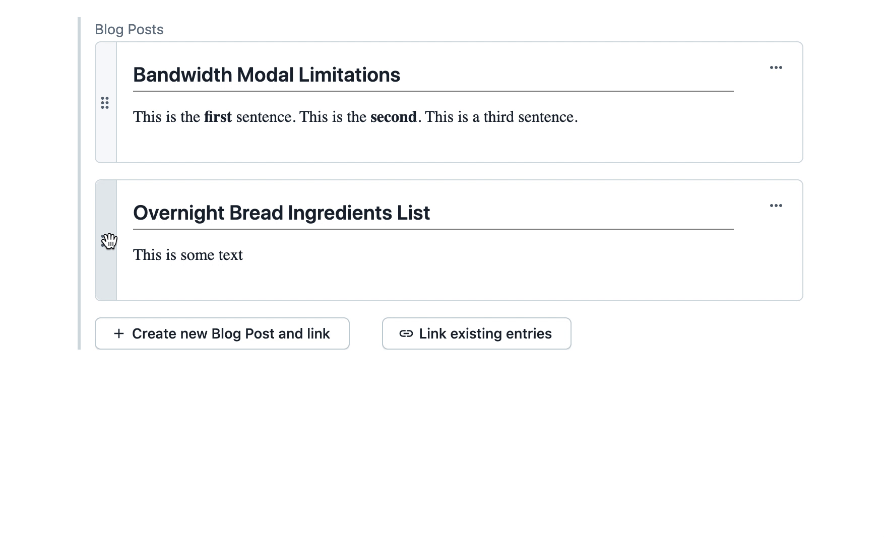
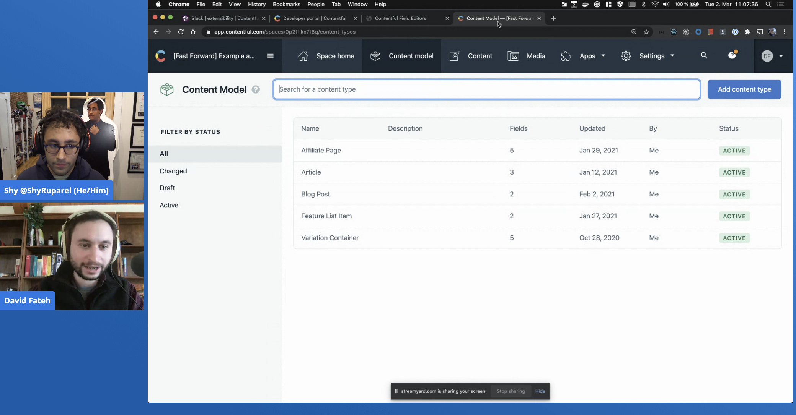

# Custom Reference Field App

This is an example app which shows how to create a custom
[reference field](https://www.contentful.com/help/references/) inside
of a Contentful entry. In this app, we remove the default reference field and
replace the experience with a custom card
UI using [Forma 36](https://f36.contentful.com/)
as our component and layout library.

## Understanding the code

This app uses the [Create Contentful App](https://github.com/contentful/create-contentful-app) CLI tool to bootstrap the project.
In it, we've focused on using the [field location](https://www.contentful.com/developers/docs/extensibility/app-framework/locations/#entry-field)
by creating a React component which makes calls to the Contentful API using the
[App SDK](https://www.contentful.com/developers/docs/extensibility/app-framework/sdk/).

This app is based off a prototype we built on
the Contentful developer [live stream](https://www.youtube.com/watch?v=UFMNO5ZXce0).

## Available Scripts

In the project directory, you can run:

#### `npm start`

Creates or updates your app definition in contentful, and runs the app in development mode.
Open your app to view it in the browser.

The page will reload if you make edits.
You will also see any lint errors in the console.

#### `npm run build`

Builds the app for production to the `build` folder.
It correctly bundles React in production mode and optimizes the build for the best performance.

The build is minified and the filenames include the hashes.
Your app is ready to be deployed!

## Libraries to use

To make your app look and feel like Contentful use the following libraries:

-   [Forma 36](https://f36.contentful.com/) – Contentful's design system
-   [Contentful Field Editors](https://www.contentful.com/developers/docs/extensibility/field-editors/) – Contentful's field editor React components

## Learn More

[Read more](https://www.contentful.com/developers/docs/extensibility/app-framework/create-contentful-app/) and check out the video on how to use the CLI.

Create Contentful App uses [Create React App](https://create-react-app.dev/). You can learn more in the [Create React App documentation](https://facebook.github.io/create-react-app/docs/getting-started) and how to further customize your app.